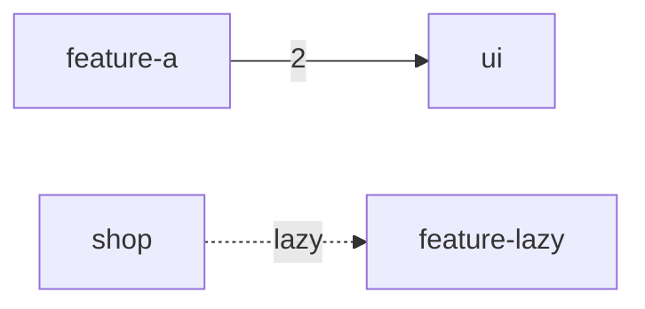

# Reports & Output Formats

## JSON (`analyze`)

The complete, deterministic report (stable sort — safe to diff and snapshot):

```jsonc
{
  "components": [ /* Angular components with full metadata + resolved imports */ ],
  "directives": [], "pipes": [], "services": [], "modules": [],
  "react_components": [ /* React function components */ ],
  "source_files": [
    {
      "path": "libs/ui/src/lib/button.component.ts",
      "package_name": "ui",
      "exports": [ { "name": "UiButtonComponent", "kind": "Class" } ],
      "imports": [ /* resolved static imports */ ],
      "dynamic_imports": [ /* lazy edges */ ],
      "used_import_names": [ "ButtonConfig" ]
    }
  ],
  "template_usages": [
    { "component": "PageComponent", "target": "UiButtonComponent", "via": "Selector", "target_kind": "Component", "component_path": "…", "target_path": "…" }
  ],
  "import_graph": {
    "edges": [ { "from": "…", "to": ["…"] } ],
    "circular_dependencies": [ ["a.ts", "b.ts"] ]
  },
  "analysis": {
    "stats": { /* projects, dependencies, project_cycles */ },
    "unused": { /* unused_exports, test_only_exports, declared_not_rendered, orphan_files */ },
    "move_candidates": [],
    "boundary_violations": [],
    "react_usage": [ /* only when React components exist */ ]
  }
}
```

Paths are relative to the working directory the analyzer was invoked from.

## HTML (`html`)

One self-contained file — inline CSS/JS, no CDN, works offline and in air-gapped CI artifacts. Contains an interactive SVG project graph (click a node to highlight its dependencies; lazy edges dashed; application projects outlined) and tables for every analysis. Light/dark theme follows the OS.

```bash
nx-analyzer -d . html -o report.html
```

## Mermaid & DOT (`graph`)

Mermaid renders natively in GitHub/GitLab markdown — paste the output into a PR description:

```bash
nx-analyzer -d . graph --format mermaid
```



DOT for Graphviz pipelines (`--level file` available for the full file graph):

```bash
nx-analyzer -d . graph --format dot | dot -Tsvg > graph.svg
```

## SARIF (`sarif`)

SARIF 2.1.0 for GitHub code scanning:

```bash
nx-analyzer -d . sarif -o results.sarif
```

| Rule id | Finding |
|---|---|
| `unused-export` | symbol nothing uses |
| `declared-not-rendered` | Angular entity wired up but never rendered |
| `orphan-file` | file with no incoming dependencies |
| `circular-dependency` | file-level cycle |
| `boundary-violation` | NX tag rule violation |

Upload in GitHub Actions:

```yaml
- run: nx-analyzer -d . sarif -o results.sarif
- uses: github/codeql-action/upload-sarif@v3
  with:
    sarif_file: results.sarif
```

## Terminal

Each analysis subcommand prints a human-readable summary; combine with [filters](../cli-reference.md) (`--project`, `--kind`, `--from`) to narrow output.
